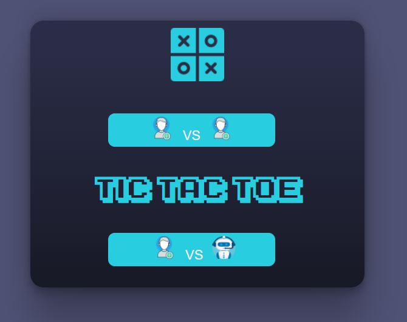
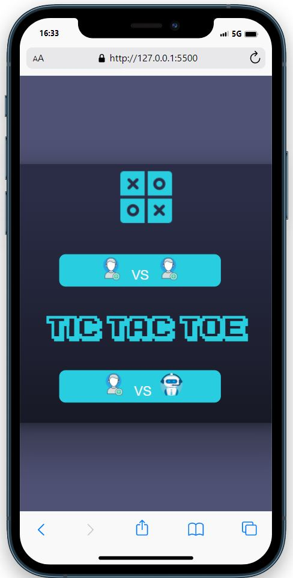
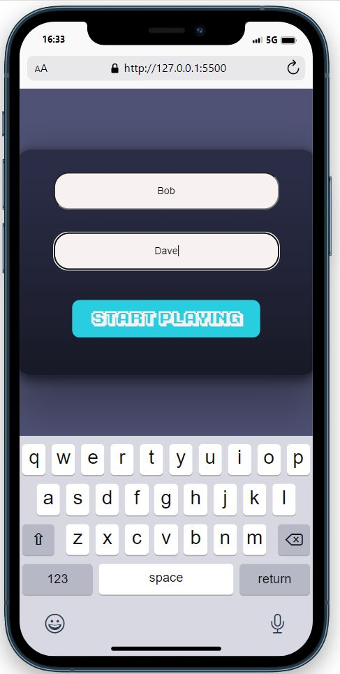
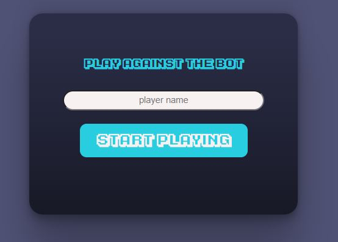
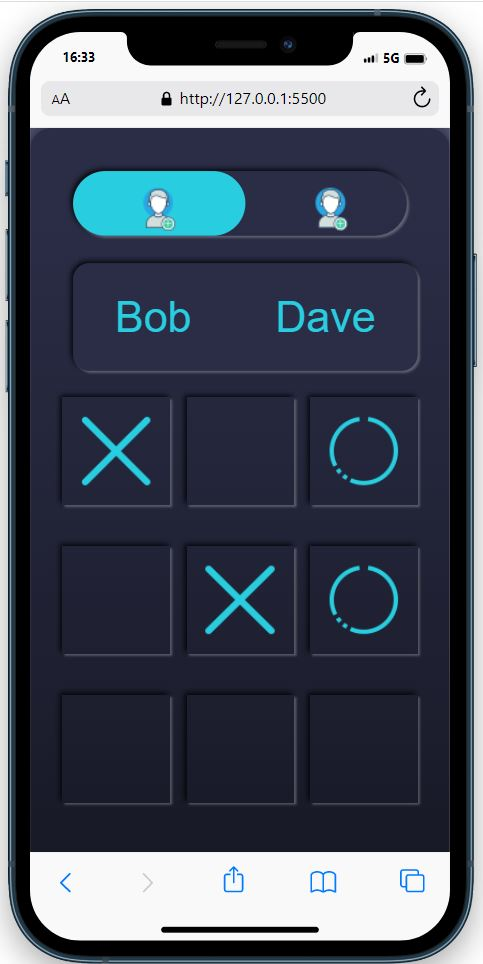
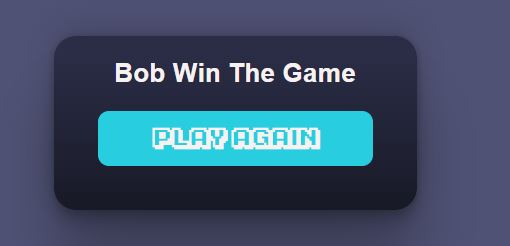

# Tic Tac Toe Game

## Table of Contents

- [About](#about)
- [Getting Started](#getting_started)
- [Usage](#usage)
- [Contact](#contact)

## About 

The aim of this project is to create a program that allows us to play tic-tac-toe against a human opponent or against a machine.
tic-tac-toe against a human opponent or against the machine.

Check the demo <a href="https://a-toscan.github.io/Tic_Tac_Toe/">here</a>

## Getting Started 

For this first part of the project, only the graphic part of the CSS layout is required.

In the second part, JavaScript will be added.

### Prerequisites

The functional requirements are as follows:

RF1 - The user must be able to start a new game by entering their
name and choosing the game mode (human vs human or human vs machine).

RF2 - When starting a new game a 3x3 board will be created with the default values.
default values.

RF3 - When starting a new game a side panel will be created with the
player information (whose turn it is to move and how many pieces they have left).
remaining counters.

RF4 - Each player can have a maximum of three pieces in play.

Example of the starting page:

example of the player vs player inputs (mobile first)

example of player vs bot input

main board game

example of the winner box

### Installing

I initially created several HTML pages concatenated together.
The Index with the Input pages, then I created the central part of the board, and finally the Winner pop-up.

Through the use of CSS I modelled the layout.

I've installed a specific font called KA1, I used some icons for Vector Icons page.

Second part of the project, using the method SPA, Single Page Application, I did delete all the HTML pages except Index.html, and integrated the html with Javascript.
Different javascript pages have been created for each section of the game.

Added also the movement on the board game with X and O.

## Usage 

Classic Tic Tac Toe game. 
Choose whether to play against an opponent or the Bot,
enter your name and start playing. Touching the squares will mark X (in the case of a second player O). 

## Built with:

## License 

Project for the GeeksHubs Full Stack Bootcamp 2023

Author: Antonio Toscano

## Contact:

